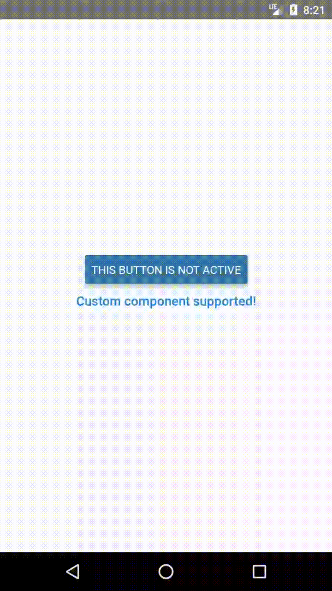

# react-native-nested-selects
Simple react native component that easily allows you to create switchable components.

## Documentation
- [Preview](#preview)
- [Installation](#installation)
- [Usage](#usage)

### Preview


### Installation
Install the package using npm:
```shell
npm i --save react-native-onoff-component
```

### Usage
#### Example
This is the code for the app used in [preview](#preview).
```typescript jsx
import React, { useState } from "react";
import { View, StyleSheet } from "react-native";
import { Button } from "react-native-elements";
import {OnOffChanger} from "react-native-onoff-component";

export default () => {
    const [active, setActive] = useState(false),
        [secondActive, setSecondActive] = useState(false);

    return (
        <View style={styles.wrapper}>
            <OnOffChanger
                active={active}
                onPress={() => setActive(!active)}
                $ontitle="This button is active"
                $offtitle="This button is NOT active"
                $offcolor="#3478ac"
                $oncolor="#56acc0"
            />
            <OnOffChanger
                component={Button}
                active={secondActive}
                onPress={() => setSecondActive(!secondActive)}
                type="clear"
                $ontitle="Custom text component is active"
                $offtitle="Custom component supported!"
            />
        </View>
    );
};

const styles = StyleSheet.create({
    wrapper: {
        flex: 1,
        justifyContent: "center",
        alignItems: "center",
    },
});
``` 

### Usage

The `OnOffChanger` simply passes the props to the component. 
If there is not prefix set, the prop will simply be passed without any changes to it.

| Prefix | Description |
|-|-|
| `$on` | Prop will be passed if the component is active |
| `$off` | Prop will be passed if the component is NOT active |

If you do want to pass the prop with the prefix, you have to use a `BREAKER`.
```typescript jsx
import {OnOffChanger} from "react-native-onoff-component";

<OnOffChanger
    $ontitle="Button active"
    $offtitle="Button not active"
    _$ontitle="Custom prop" // Prop will be passed to the component without the breaker
/>
```

If you want to use custom components, pass them. 
(Note: You must pass the component, not the component in JSX format!)
```typescript jsx 
import {OnOffChanger} from "react-native-onoff-component";
import { Button } from "react-native-elements";

<OnOffChanger
    component={Button}
    $ontitle="Button active"
    $offtitle="Button not active"
/>
```
